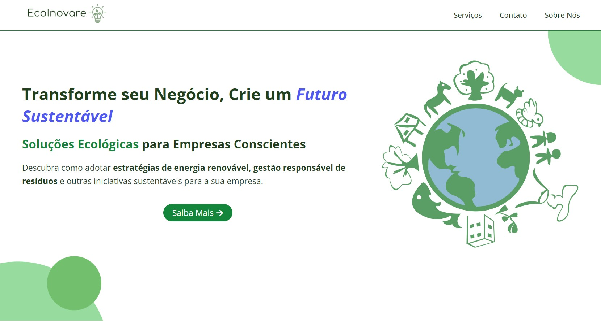

# 🔥 EcoInovare - Soluções Ecológicas para empresas (em andamento)

## Descrição
- Aplicação front-end que fornece planos de serviços sustentáveis personalizados para outras empresas.
- Estou utilizando HTML5, CSS3 e Javascript (puro) para desenvolvê-la.
- Futuramente, pretendo adicionar funcionalidades ao sistema: como um CRUD talvez.
## Licença
Este código está licenciado usando a [licença-MIT](./LICENSE).
 
